# Desenvolvendo template LaTex para artigos acadêmicos usando ferramentas do GitHub
Filipe Soares Câncio, Crijina Chagas Flores

**Aviso**: esse repositório é o **ARTIGO**. para acessar o projeto clique [aqui](https://github.com/filipecancio/sbc-template).

> Abstract: The present article deals with the development of a Github repository template that allows the elaboration of scientific articles with the standards presented by SBC - Brazilian Computer Society using the LaTex language for writing and Github DevOps tools for automatic configuration and finalization of the pdf format.

> Resumo: O artigo presente aborda o desenvolvimento de um template de repositório do github que permite a elaboração de artigos científicos com as normas apresentadas pela SBC - Sociedade Brasileira de Computação usando a liguagem LaTex para escrita e ferramentas de DevOps do Github parar configuração e finalização automáticas do formato pdf.

## Introdução
A sociedade acadêmica utiliza as mais variadas plataformas para a elaboração de textos acadêmicos, como o Word, Google Docs, e Overleaf. O uso de funcionalidades como compatilhamento online em tempo real do Google Docs e histórico de versão, permite aos pesquisadores uma facilidade na hora de tornar seus projetos em um documento público, principalmente se for um trabalho conjunto, seja entre autor e orientador, ou entre autores.
Nesse mercado de suítes de escritório, o Overleaf se destaca por ter uma interface amigável assim como os demais concorrentes, porém fazendo o uso da linguagem de marcação LaTex, que possibilita a elaboração do conteúdo científico sem os atrasos de configuração, normas e formatação de texto.
Apesar de todas as facilidades que essas ferramentas fornecem, existem limitações de mercado, que obrigam ao usuário a pagar por um plano que permita o uso, como é o caso do Word e do Overleaf, ou que possuam limitações no controle de versão como é o caso do Google Docs e do Word.
O artigo presente aborda uma elaboração de uma alternativa a essa plataformas de desenvolvimento de gêneros acadêmicos. Inspirado na ferramenta Overleaf, o projeto utilizou da tecnologia LaTex para criar um ambiente de desenvolvimento de artigos capaz de gerar arquivos no formato .pdf em tempo real, com o mínimo de conhecimento de LaTex de forma totalmente gratuita, seja online ou offline.

## Sobre o projeto

A solução apresentada foi desenvolvida em um repositório do Github chamado ``filipecancio/sbc-template`` (figura 1) possuindo o template LaTex oficial da SBC (Sociedade Brasileira de Computação) para a produção de artigos. O acesso está disponível em [filipecancio/sbc-template](https://github.com/filipecancio/sbc-template). O repositório, ao ser acessado, se converte em um ambiente de desenvolvimento (Devcontainer), aonde não há necessidade de conhecimento em programação, basta editar qualquer arquivo ``.tex`` e é gerado um ``.pdf`` formatado no padrão SBC.

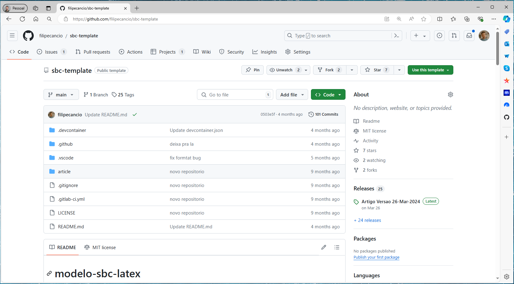

**Figura 01 - Repositório filipe/sbc-template**

### Funcionalidades

Como solução alternativa às plataformas apresentadas anteriormente, o projeto possui algumas funcionalidades semelhantes porém, mais abrangentes e disponíveis de forma gratuita. Podemos visualizar abaixo um breve comparativo entre as plataformas.

| Plataformas | Usa LaTex | Colaborativo | Controle de versão | Offline |
|-|-|-|-|-|
|Overleaf | Sim | Só na versao paga | Só na versao paga | Não |
|Microsoft Word | Não | Sim | Limitado | Sim |
|Google Documentos | Não | Sim | Limitado | Não|
|filipecancio/sbc-template | Sim | Sim | Sim | Sim|

**Tabela 1 - Comparativos entre plataformas**

Dentre as funcionalidades citadas acima (tabela 1), podemos destacar as seguintes características do projeto ``filipecancio/sbc-template``:

- Colaborativo: As ferramentas Word e Google Documentos utilizam serviços de nuvem (OneDrive e Drive, respectivamente) para compartilhar documentos. O Overleaf necessita de um plano pago para executar esse compartilhamento entre diferentes contas. Já o projeto ``filipecancio/sbc-template`` utiliza as ferramentas do GitHub, que são gratuitas, para realizar o compartilhamento.
- Controle de versão: O Word e o Google Documentos possuem um controle de versão que permite apenas visualizar histórico de edições recentes de diferentes usuários. O Overleaf permite integração com GitHub e GitLab para controle de versão, porém precisa de um plano pago para habilitar a integração. O projeto ``filipecancio/sbc-template`` utiliza o controle de versão do Git (integrado ao GitHub), que possui toda uma estrutura para o desenvolvimento de software e essa estrutura é - Offline: O Word possui versão offline, porém necessita de um plano pago. O Overleaf e o Google Documentos não possuem versão offline. O projeto ``filipecancio/sbc-template`` utiliza o Visual Studio Code para edição offline.

O projeto possui, além das caracteristícas acima, uma versatilidade para diferentes perfis de usuário. Mesmo voltado para iniciantes em LaTex e pessoas que não estão acostumadas com linguagens de programação, é útil para pessoas com conhecimento avançado nessa linguagem de marcação. 

O usuário deve possuir uma conta no GitHub para acessar o repositório ``filipecancio/sbc-template``, clonar com o nome desejado, de preferência com o nome do artigo, e começar a editar os arquivos de acordo ao manual de instruções disponível no arquivo ``README.md``.

As edições podem ocorrer de três formas:

- Pelo  site do GitHub: Acessando pelo, você pode clicar diretamente nas pastas do diretório e nos arquivos correspondentes. O site permite a edição e dependendo da remificação escolhida, gera um ``.pdf`` após a edição (figura 2).    
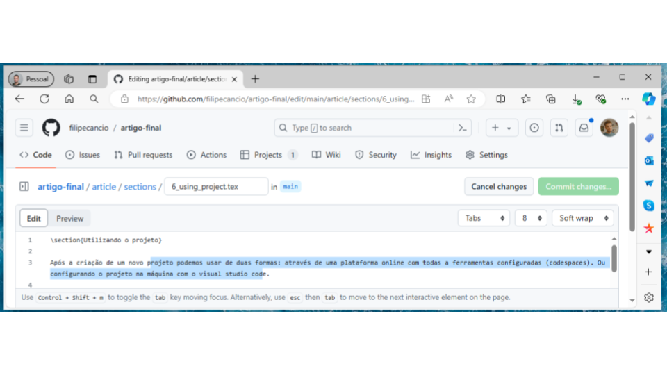
**Figura 02 - Utilizando o projeto no site do GitHub**

- Pela plataforma Codespaces: O GitHub disponibiliza a edição  de forma mais completa utilizando o Codespaces, uma ferramenta que simula uma máquina e o Visual Code Studio no navegador, que pode ser acessada seguindo as instruções do repositório. O acesso pelo Codespaces permite o uso de todas funcionalidades de forma online (figura 3).
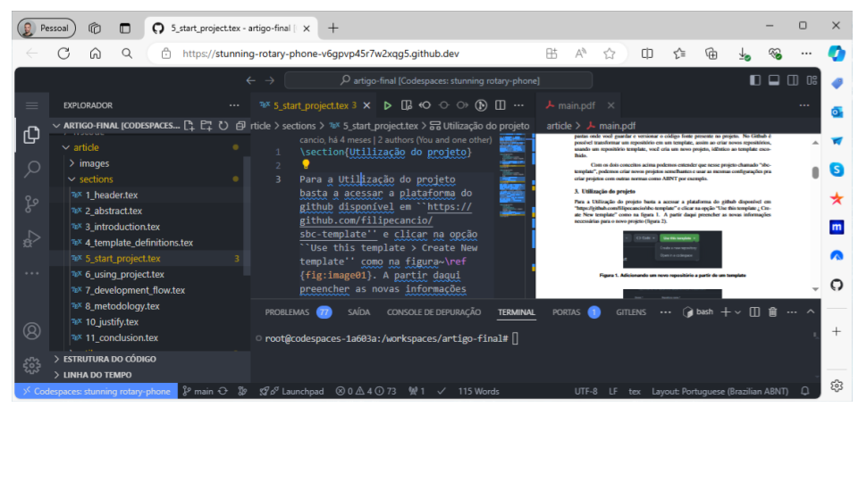
**Figura 03 - Utilizando o projeto pelo Codespaces**

- Pelo Visual Studio Code: para o acesso offline, basta clonar o projeto seguindo as instruções no repositório e acessar o Visual Studio Code (figura 4).
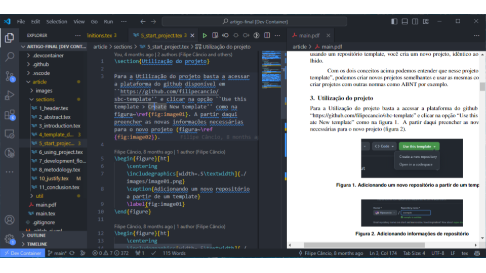
**Figura 04 - Utilizando o projeto com Visual Studio Code**

Para tornar as formas de edições apresentadas mais intuitivas, o projeto possui um manual de instruções no arquivo ``README.md`` que orienta o usuário a editar o artigo. O manual é dividido em seções que explicam como clonar o projeto, editar o artigo, gerar o ``.pdf`` e subir as alterações para o GitHub. O manual também possui em cada seção vídeos tutoriais que mostram o passo a passo de cada ação, auxiliando usuários que não estão acostumados com a plataforma e possivelmente tenham dificuldade em seguir as intruções em texto.

Por ser desenvolvido no Github o versionamento é realizado utilizando o controle de versão Git. As instruções de versionamento no manual são voltadas para o básico de git apresentando apenas conceitos iniciais que podem ser usados diretamente no site ou com as ferramentas do Visual Studio Code e Codespaces.

### Destaques
O projeto faz uso de três ferramentas do GitHub que valem a pena destacar. São estes: Releases, Pull Requests e Projects.
- Releases: É possivel criar versões implementavéis e empacotadas de um projeto para o público. A releases disponibilizam todas as versões e seus respectivos empacotáveis em uma página com informações de novas funcionalides, data de submissão, autores, entre outros.  [GitHub 2023b]
- Pull Request: Uma Pull Request é uma página com propostas para mesclar as alterações feitas em uma branch para outra  [GitHub 2023d]. No nosso projeto, as Pull Requests são utilizadas para correções e melhorias do artigo.
- Project: É uma funcionalidade que integra Pull Requests afim de facilitar a gestão de projetos  [GitHub 2023c].

No projeto ``filipecancio/sbc-template`` as versões implementavéis que as Releases carregam são arquivos no formato ``.pdf``. A cada nova edição, o projeto gera um novo ``.pdf`` com as alterações realizadas. A cada commit gerado na banch de ``main`` é gerada uma versão de release com o ``.pdf`` datado (figura 5). Essa funcionalidade descarta qualquer necessidade de salvar versões de ``.pdf``, uma vez que o github tem tudo salvo e documentado.

**Figura 05 - Detalhes da ultima release**

Os artigos não precisam ser desenvolvidos na ramificações ``main``. O manual de instruções do projeto orienta que o pesquisador deve criar novas ramificações para implementar novos tópicos e correções. Associado a isso, pode ser utilizada a ferramenta de Pull Requests do GitHub para promover entre autor e orientador o controle das mudanças em cada versão, facilitando a correção dos artigos (figura 6). O uso de pull requests permite que o repositório gere versões de pdf exclusivas para aquela ramificação (figura 7).

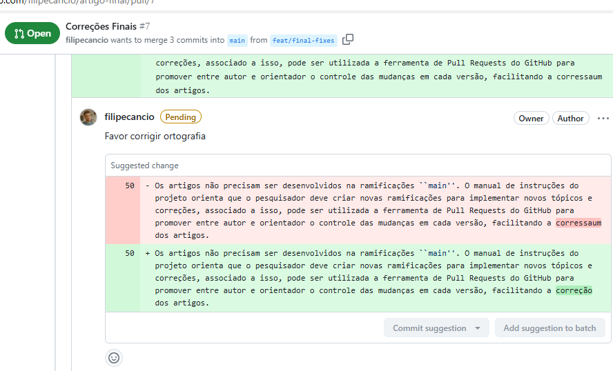
**Figura 06 - Correção de trecho do artigo por Pull Request**

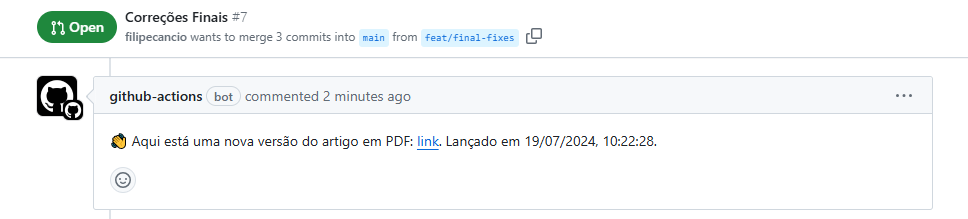
**Figura 07 - Mensagem do bot do github com link do pdf em Pull Request**

Com o GitHub Project a edição dos artigos fica ainda mais organizada. É comum nas elaborações de artigos em projetos de pesquisa a estipulação de calendários e cronogramas. No projeto, as próprias Pull Requests se tornam o cronograma do artigo, nelas podemos descrever o que será trabalhado de forma completa e documentada, com prazos, legendas e pessoas envolvidas na revisão. É possível inclusive visualizar de três diferentes formas: como tabela (figura 8), quadros (figura 9) e gráfico GANTT (figura 10).

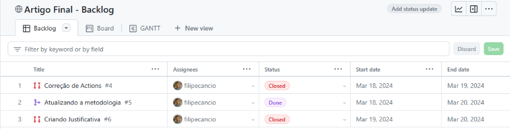
**Figura 08 - Visualização de Pull Request como tabela no GitHub Project**

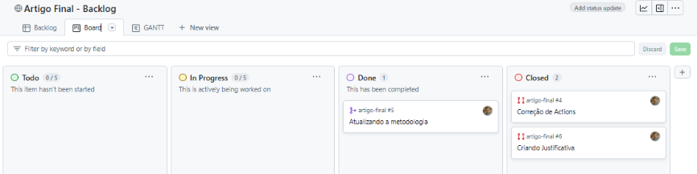
**Figura 09 - Visualização de Pull Request como quadro no GitHub Project**

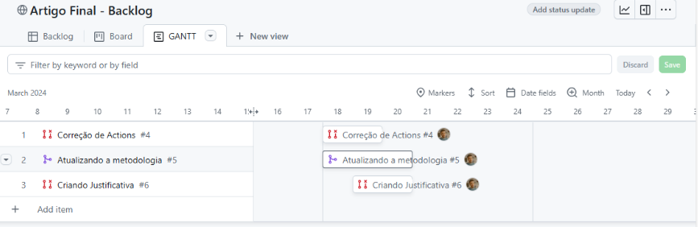
**Figura 10 - Visualização de Pull Request como GANTT no GitHub Project**

Estes destaques tornam o projeto interessante para a comunidade acadêmica. A possibilidade de manter um artigo no github com registros de alteração de cada parte envolvida também garante proteção contra possíveis fraudes e plágios. É possivel acessar e editar em qualquer plataforma com internet, tornando a escrita acessível a qualquer pessoa na comunidade.

### Metodologia

Para realizar as atividades propostas foi necessário o planejamento de cada etapa. As ferramentas Project e Pull Requests do Github Auxiliaram na organização tanto durante a etapa de planejamento quanto durante as entregas de cada versão.

Todo o projeto foi planejado utilizando de método DevOps afim de realizar constantes entregas a cada nova mudança e acompanhar integração das novas funcionalidades. A utilização da ferramenta de Releases acompanhada da Actions foi crucial para cada integração e mudança realizada.

O desenvolvimento consistiu na criação de um ambiente de desenvolvimento utilizando Devcontainer, regras para gerar os arquivos ``.pdf``, testes, lint e uso do ambiente de forma online e offline e implementação do modelo LaTex de para formatação de textos.

A criações de regras para testes, lint para o Latex, e gerações de ``.pdf`` foram feitas utilizando a integração do projetos ``a-nau/latex-devcontainer`` e ``danteev/texlive`` que possui compilador e lint para o LaTex e ``xu-cheng/latex-action@v2`` para geração dos pdfs nas versões de release e desenvolvimento.

As versões de Devcontainer para o uso online foram configuradas com Codespaces e offline com Visual Studio Code e Docker.

Para a desenvolvimento da formatação do LaTex, foi utilizado o [template oficial da SBC](https://www.sbc.org.br/documentos-da-sbc/category/169-templates-para-artigos-e-capitulos-de-livros). As informações em Latex usadas para a configuração de fonte, margens e demais formatações foram colocadas na pasta ``util`` com os arquivos $sbc.bst$ e $settings.sty$. Desta forma é possível usar o mesmo projeto sbs-template para a elaboração de outros tremplates em Latex apenas trocando as cofigurações destes arquivos.

Os testes de integração e lint foram executados durante o desenvolvimento porém a elaboração do artigo presente também fez parte da etapa de testes do projeto. Todo o artigo foi utilizado, para testar as funcionalidades, realizar melhorias e parte do conteúdo de apresentação e tutorial do projeto utilizou capturas de tela e gavações do artigo presente.

## Desenvolvimento

Durante o desenvolvimento foi elaborado o repositório chamado ``filipecancio/sbc-template`` desenvolvido utilizando de integração contínua, implementando primeiramente pipelines de verificação do Latex a cada salvamento de arquivo ``.tex``, pipelines para escolha de um arquivo .pdf alvo e posteriormente uma verificação final a cada commit gerado e submetido ao site do GitHub. Em paralelo foi utilizada da entrega contínua a geração automática de ``.pdf`` e seus formatos de disponibilização. Ao total foram três formatos: Geração de ``.pdf`` instantânea a cada arquivo salvo, Geração para versão de release, e geração de ``.pdf`` a cada versão de pull request.

Para facilitação do uso do projeto para usuários comuns toda a parte escrita é restingida para a pasta ``article``. Dentro dela temos um arquivo principal chamado ``main.tex``, uma pasta chamada sections, onde posuem arquivos ``.tex`` de exemplo que podem ser substituidos ou reescritos, uma pasta de imagens e uma pasta chamada ``util`` usada para configuração interna do Latex.
Foi foi um manual de uso, presente no arquivo ``README.md`` do projeto, com um passo a passo completo.

Toda a implementação CI/CD (integração contínua, entrega contínua) foi implementada na elaboração do Devcontainer do projeto presente na pasta ``.devcontainer`` (figura 11). Nos próximos tópicos veremos em detalhes a elaboração do ambiente de desenvolvimento e das automações
presentes.

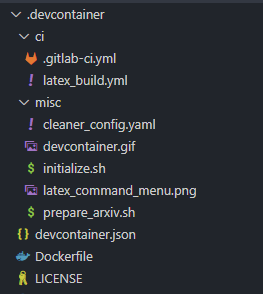
**Figura 11 - Estrutura de arquivos do devcontainer**

### Devcontainer
Os containers Docker são soluções de virtualização semelhantes às máquinas virtuais, porém mais enxutas e apenas com as informações necessárias para a sua execução  [Vitalino 2016]. Para a criação de um container utilizamos uma imagem Docker, uma espécie de documento que declara as informações necessárias para determinado container. Entre essas informações podemos citar por exemplo o sistema operacional, aplicativos que o container deve conter, comandos iniciais ao criar o container e conexões de rede local.
Os Devcontainers ou containers de desenvolvimento são containers Docker que possuem um ambiente completo com todas as configurações necessárias para o desenvolvimento de uma aplicação [GitHub 2022]. No repositório ``filipecancio/sbc-template`` usamos o Devcontainer para configurar todo o projeto latex, com o compilador para o ``.pdf``, ferramentas de edição e formatação do arquivo e uso de extensões do Visual Studio Code. Assim além de um projeto completo poder ser usado em uma maquina física com uma configuração automática, o mesmo pode ser facilmente removido sem muitas complicações em desinstalar o projeto e suas dependências.
Na figura 12, podemos visualizar o repositório ``filipecancio/sbc-template`` em execução no Visual Studio Code e ao lado o container em execução no docker. Podemos analisar o uso da CPU e memória do container em tempo real.

**Figura 12 - Visualizando o devcontainer pelo Visual Studio Code e dashboard do Docker**

A implantação do devcontainer consistiu nos diretórios ``.devcontainer`` e ``.vscode``, que respectivamente possui uma serie de arquivos de configuração para instalação de dependências e scripts para a execução dessas dependências no container; e arquivos de configuração para o comportamento das dependências.
No diretório .devcontainer temos o arquivo devcontainer.json (figura 13) que declara a imagem Docker pelo arquivo Dockerfile, a lista de extensões desejáveis e o script de inicialização do Devcontainer. O dockerfile possui uma imagem de referência ``danteev/texlive`` que cria um container Ubuntu com o compilador TexLive. O script ``initialize.sh`` inicia a configuração do Visual Studio Code e o CI (continuous integration) do container. As configurações de CI permitem que todas as vezes que o projeto é alterado, um novo arquivo PDF é gerado e sobrescreve o antigo na pasta article.

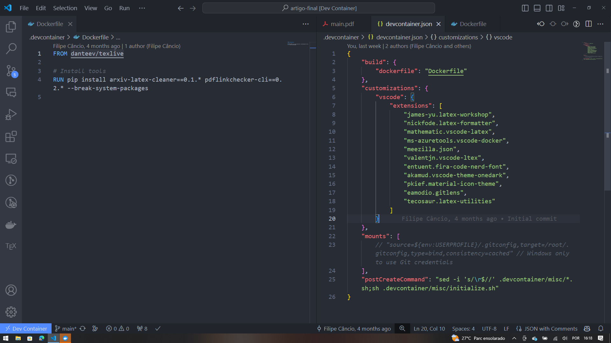
**Figura 13 - Arquivos dockerfile e devcontainer.json respectivamente**

### Actions

O Github Actions é uma plataforma criada pelo GitHub que utiliza de containers docker para a realização de integração contínua e entrega cotínua (CI/CD) [GitHub 2023a]. Através do GitHub Actions podemos criar testes automatizados, validações de projeto, criar versões compiladas de arquivos, entre outras atividades [GitHub 2023a]. Em nosso projeto utilizamos o Github Actions para duas atividades, em ambos os casos para gerar um pdf final do projeto. O que diferencia em cada caso é que temos na pasta .github (figura 14), o arquivo $latex_build.yml$ que gera um PDF em branchs de pull requests abertas, ao subir um novo commit, o pdf é gerado e em seguida é criado um comentário na pull request. Ja o arquivo $latex_release.yml$ configura o PDF para virar uma versão de release na página inicial do repositório.

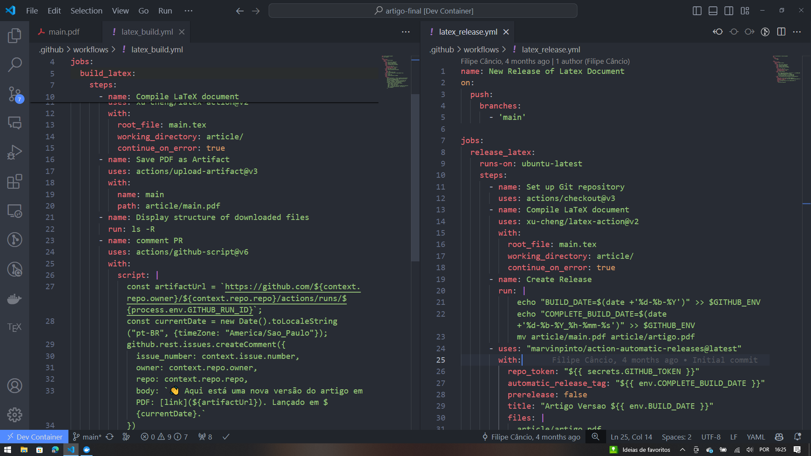
**Figura 14 - Arquivos $latex_build.yml$ e $latex_release.yml$ respectivamente**

A vantagem do github actions é permitir a edição e atualização do projeto sem necessáriamente criar um ambiente devcontainer para edições rápidas e discussões entre autor e orientador. Ao alterar qualquer arquivo no site do github, as actions se encarregam de gerar um novo artigo final em PDF.

## Conclusão e Trabalhos futuros

O projeto realizado teve por motivação inicial a facilitação do desenvolvimento de artigos científicos no Instituto Federal de Educação Ciência e Tecnologia da Bahia, campus Vitória da Conquista. Atualmente o modelo SBC é utilizado em matérias como Trabalho de conclusão de curso, Metodologia de Pesquisa Científica e Inteligência de Negócio para a apresentação de atividades avaliativas. Com a utilização do projeto nessas atividades, alunos terão facilidade na produção de generos academicos e professores e orientadores poderão padronizar e ter mais controle sobre projetos de extensão e pesquisa no campus.

Para divulgação do projeto no campus foi apresentado o minicurso Criando Artigos com LaTex e Github na Semana de Tecnologia da Informação (Week-IT) edição de 2023 onde foi apresentado o template e ensinado o basico para a sua utilização, e partir da dinâmica e feedback dos participantes criada uma playlist no youtube ensinando passo a passo a utilizar o projeto na produção dos gêneros acadêmicos.

Como sugestão para rabalhos fututos, o projeto pode receber melhorias como integração com a inteligência artificial da Microsoft, Copilot, para correções ortográficas em diferentes idiomas; também novas versões com templates específicos entre a faculdade,seja para os demais cursos de graduação, ou técnico. É possivel implementar o projeto para outras plataformas, como desenvolver o projeto usando o devcontainer nos produtos da Jetbrains (inteliJIDEA e Android Studio), isso permitiria que desenvolvedores Java e Android usassem o mesmo respositório de suas aplicações para desenvolver os seus artigos.

Espera-se que com esta ferramenta mais pessoas dentro do curso de Sistemas de Informação venham usar o LaTex para a produção de seus artigos, permitindo que autores e orientadores tenham mais controle sobre a produção de artigos científicos e que o Instituto possa ter um acervo virtual de artigos científicos produzidos por seus alunos e professores.

### Referências

- GitHub (2022). Introdução aos contêineres de desenvolvimento. Disponível
em: [docs.github](https://docs.github.com/pt/codespaces/setting-up-your-project-for-codespaces/adding-a-dev-container-configuration/introduction-to-dev-containers). Acesso em: mar. de 2024.
- GitHub (2023a). Entendendo o github actions. Disponível em: [docs.github](https://docs.github.com/pt/actions/learn-github-actions/understanding-github-actions). Acesso em: mar. de 2024.
- GitHub (2023b). Sobre as versões. Disponível em: [docs.github](https://docs.github.com/pt/repositories/releasing-projects-on-github/about-releases). Acesso em: mar. de 2024.
- GitHub (2023c). Sobre projects. Disponível em: [docs.github](https://docs.github.com/pt/issues/planning-and-tracking-with-projects/learning-about-projects/about-projects). Acesso em: mar. de 2024.
- GitHub (2023d). Sobre solicitação de pull. Disponível em: [docs.github](https://docs.github.com/pt/pull-requests/collaborating-with-pull-requests/proposing-changes-to-your-work-with-pull-requests/about-pull-requests). Acesso em: mar. de 2024.
- Vitalino, J. F. N. (2016). Descomplicando Docker: o guia definitivo para iniciantes.
Brasport, 1th edition.
